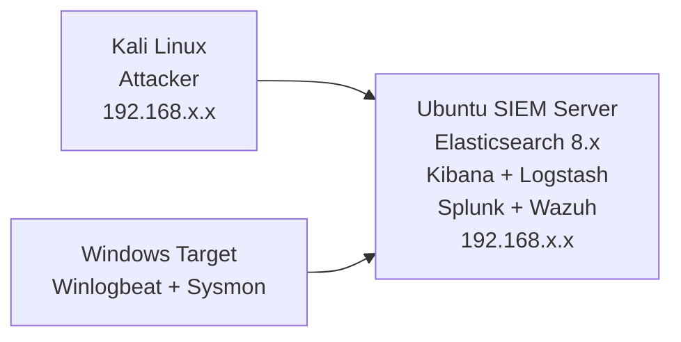
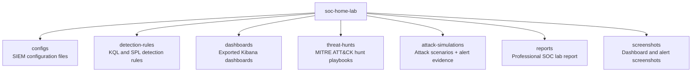

# SOC Home Lab

Enterprise SOC home lab, ELK Stack SIEM, Splunk, Wazuh XDR. Detection rules, threat hunting, attack simulations, dashboards.

# SOC Home Lab — Enterprise SIEM Environment

Status: Active Build  
Lab Start Date: May 2024  
Name: Hammad Khan

## Project Overview

A fully functional Security Operations Center (SOC) home lab built from scratch on virtual machines. This lab replicates an enterprise SOC environment using three industry-standard SIEM platforms.

This is a living project — detection rules, dashboards, and attack simulations are added continuously.

## Lab Architecture

## SIEM Stack

| Platform | Version | Purpose |
|----------|---------|---------|
| Elasticsearch | 8.x | Log storage and search engine |
| Kibana | 8.x | Dashboards and SIEM interface |
| Logstash | 8.x | Log parsing and enrichment pipeline |
| Splunk Enterprise | 9.x | Secondary SIEM — SPL detection |
| Wazuh | 4.x | XDR — FIM, vulnerability detection |

## Repository Structure

## Detection Rules (MITRE ATT&CK Mapped)

| Rule | Technique | Tactic |
|------|-----------|--------|
| Brute Force Detection | T1110 | Credential Access |
| New Local Admin Account | T1136 | Persistence |
| PowerShell Encoded Command | T1059.001 | Execution |
| Suspicious Parent Process | T1055 | Defense Evasion |
| RDP Brute Force | T1110.001 | Credential Access |
| Large Outbound Transfer | T1041 | Exfiltration |
| C2 Beaconing Pattern | T1071 | Command and Control |
| Lateral Movement via SMB | T1021.002 | Lateral Movement |
| Privilege Escalation | T1078 | Privilege Escalation |
| Credential Dumping | T1003 | Credential Access |

## Attack Simulations Performed

Brute force SSH/RDP (Hydra from Kali)  
PowerShell encoded command execution  
Privilege escalation simulation  
Lateral movement via SMB  
Data exfiltration simulation  
C2 beaconing pattern

## Dashboards Built

SOC Overview — real-time alert summary  
Failed Login Attempts — by user, IP, time  
Network Traffic Analysis  
Process Execution Monitor  
User Account Changes  
Geographic IP Map  
Threat Severity Timeline  
Alert Triage Queue

## Tools and Technologies

Elasticsearch, Kibana, Logstash, Splunk, Wazuh, Filebeat, Winlogbeat, Sysmon, KQL, SPL, MITRE ATT&CK, Python

## Lab Build Log

| Date | Milestone |
|------|-----------|
| May 2024 | Lab environment setup, Ubuntu SIEM server deployed |
| May 2024 | Elasticsearch and Kibana installed and configured |
| May 2024 | Log ingestion pipeline configured |
| May 2024 | Detection rules written and tested |
| May 2024 | Attack simulations performed |
| May 2024 | Dashboards built and exported |

## Related Reports

reports/soc-lab-report.md — Full technical report  
detection-rules/rules-explained.md — Rule documentation

Part of my cybersecurity portfolio — built command by command in a real lab.  
Connect: LinkedIn
