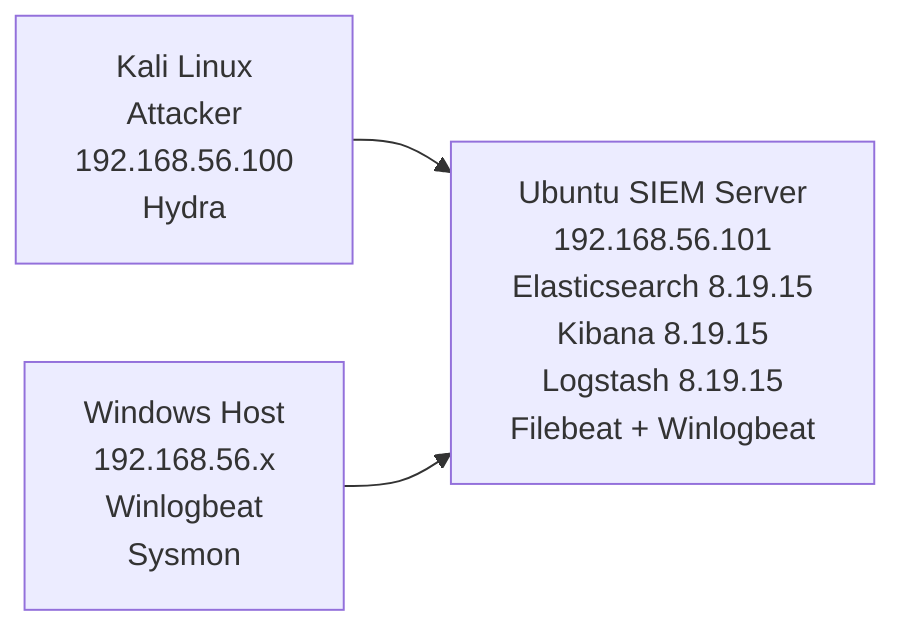

# SOC Home Lab — Enterprise SIEM Environment

A fully functional Security Operations Center (SOC) home lab built from scratch on virtual machines. Replicates enterprise SOC environment using industry-standard SIEM platforms, detection rules, and real attack simulations.

## Lab Details

| Field | Details |
|-------|---------|
| Author | Hammad Khan |
| Start Date | May 20, 2026 |
| Last Updated | June 8, 2026 |
| Status | Phase 1 Complete — ELK SIEM Operational |
| GitHub | github.com/HK101-cyber |

## Lab Architecture

## Infrastructure

| Component | Details |
|-----------|---------|
| SIEM Server | Ubuntu Server 22.04 LTS (192.168.56.101) |
| Attacker | Kali Linux (192.168.56.100) |
| Windows Host | Windows 10/11 |
| Hypervisor | VirtualBox |
| Network | Host-Only Isolated (192.168.56.x) |

## SIEM Stack — Phase 1 Complete

| Platform | Version | Purpose | Status |
|----------|---------|---------|--------|
| Elasticsearch | 8.19.15 | Log storage and search | ✅ Running |
| Kibana | 8.19.15 | Dashboards and SIEM interface | ✅ Running |
| Logstash | 8.19.15 | Log parsing pipeline | ✅ Running |
| Filebeat | 8.19.15 | Linux log agent | ✅ Running |
| Winlogbeat | 8.19.15 | Windows log agent | ✅ Running |
| Sysmon | Latest | Windows deep telemetry | ✅ Running |
| Splunk Enterprise | 9.x | Secondary SIEM | 🔄 Coming Soon |
| Wazuh | 4.x | XDR and FIM | 🔄 Coming Soon |

## Repository Structure

```mermaid
graph TD
    ROOT[soc-home-lab] --> CONFIGS[configs<br/>Service configurations]
    ROOT --> RULES[detection-rules<br/>KQL detection rules]
    ROOT --> DASHBOARDS[dashboards<br/>Exported Kibana dashboards]
    ROOT --> ATTACKS[attack-simulations<br/>Attack reports + evidence]
    ROOT --> HUNTS[threat-hunts<br/>Threat hunt reports]
    ROOT --> SCREENS[screenshots<br/>Evidence screenshots]
    ROOT --> REPORTS[reports<br/>Lab reports]
    
    CONFIGS --> ELASTIC[elasticsearch.yml]
    CONFIGS --> KIBANA[kibana.yml]
    CONFIGS --> LOGSTASH[logstash-pipeline.conf]
    CONFIGS --> BEATS[filebeat.yml + winlogbeat.yml]
    
    RULES --> RULE1[rule-01-bruteforce.md]
    RULES --> RULE2[rule-02-privesc-sudo.md]
    RULES --> RULE3[rule-03-lateral-movement.md]
    RULES --> ALLRULES[all-siem-rules.ndjson]
    
    DASHBOARDS --> AUTH[soc-auth-dashboard.ndjson]
    DASHBOARDS --> NET[soc-network-dashboard.ndjson]
    DASHBOARDS --> SYS[soc-system-dashboard.ndjson]
    DASHBOARDS --> WIN[soc-windows-dashboard.ndjson]
    
    ATTACKS --> SIM1[simulation-01-bruteforce.md]
    ATTACKS --> SIM2[simulation-02-privesc.md]
    ATTACKS --> SIM3[simulation-03-lateral-movement.md]
    
    HUNTS --> HUNT1[hunt-01-brute-force-patterns.md]
    HUNTS --> HUNT2[hunt-02-privilege-escalation.md]
    HUNTS --> HUNT3[hunt-03-lateral-movement.md]
```

## Detection Rules — MITRE ATT&CK Mapped

| # | Rule | Technique | Tactic | Severity | Status |
|---|------|-----------|--------|----------|--------|
| 1 | Brute Force SSH | T1110 | Credential Access | High | ✅ Active |
| 2 | Privilege Escalation Sudo | T1548 | Privilege Escalation | High | ✅ Active |
| 3 | Lateral Movement SSH | T1021.004 | Lateral Movement | Critical | ✅ Active |
| 4 | Suspicious Shell Process | T1059 | Execution | Medium | ✅ Active |
| 5 | Multiple Failed Auth | T1110.001 | Credential Access | Medium | ✅ Active |
| 6 | PowerShell Abuse | T1059.001 | Execution | High | ✅ Active |

## Attack Simulations Performed

| # | Attack | Tool | MITRE | Alert Fired |
|---|--------|------|-------|-------------|
| 1 | Brute Force SSH | Hydra | T1110 | ✅ Yes |
| 2 | Privilege Escalation | sudo commands | T1548 | ✅ Yes |
| 3 | Lateral Movement | SSH from Kali | T1021.004 | ✅ Yes |
| 4 | Suspicious Process | bash execution | T1059 | ✅ Yes |
| 5 | Multiple Failed Auth | SSH attempts | T1110.001 | ✅ Yes |
| 6 | PowerShell Abuse | PowerShell | T1059.001 | ✅ Yes |

Detection Rate: 6/6 (100%)

## Dashboards Built

| # | Dashboard | Panels | Data Source |
|---|-----------|--------|-------------|
| 1 | Authentication Overview | 6 | filebeat-* |
| 2 | Network Overview | 6 | filebeat-* |
| 3 | System Overview | 6 | filebeat-* |
| 4 | Windows Security | 8 | winlogbeat-* |

## Threat Hunts Conducted

| # | Hunt | Finding | Documents |
|---|------|---------|-----------|
| 1 | Brute Force Patterns | 1,197 failed attempts detected | 1,197 |
| 2 | Privilege Escalation | 891 sudo events, logging gap found | 891 |
| 3 | Lateral Movement | 69 SSH sessions over 30 days | 69 |

## Lab Statistics

Total Log Events: 500,000+  
Dashboards: 4 (26 panels total)  
Detection Rules: 6 (all active)  
Attack Simulations: 6 (100% detection rate)  
Threat Hunts: 3 (all confirmed)  
Security Gaps Found: 5  
GitHub Commits: 20+

## Lab Build Timeline

| Date | Milestone |
|------|-----------|
| May 20, 2026 | Lab environment setup — Ubuntu SIEM deployed |
| May 20, 2026 | SSH configured — PowerShell connected |
| May 20, 2026 | Elasticsearch 8.19 installed and running |
| May 22, 2026 | Kibana installed — browser verified |
| May 22, 2026 | Logstash installed — port 5044 listening |
| May 23, 2026 | Filebeat configured — 431K+ logs ingested |
| May 25, 2026 | All 5 Linux detection rules deployed |
| May 25, 2026 | Brute force attack simulated — alert fired |
| Jun 1, 2026 | Elasticsearch security configured |
| Jun 1, 2026 | Kibana encryption keys added |
| Jun 2, 2026 | All 6 attack simulations completed |
| Jun 4, 2026 | Winlogbeat installed — Windows logs ingested |
| Jun 4, 2026 | Sysmon deployed — deep Windows telemetry |
| Jun 5, 2026 | Dashboard 4 (Windows Security) built |
| Jun 5, 2026 | PowerShell attack simulated — Sysmon captured |
| Jun 8, 2026 | 3 threat hunt reports completed |
| Jun 8, 2026 | Final SOC lab report written |

## Tools and Technologies

SIEM: Elasticsearch, Kibana, Logstash  
Agents: Filebeat, Winlogbeat  
Monitoring: Sysmon (SwiftOnSecurity config)  
Attacker: Kali Linux, Hydra  
Query: KQL (Kibana Query Language)  
Framework: MITRE ATT&CK  
Platform: Ubuntu 22.04, Windows 10/11, VirtualBox  
Version Control: Git, GitHub

## Related Reports

reports/soc-lab-final-report.md — Complete technical report  
detection-rules/README.md — All rule documentation  
attack-simulations/README.md — Complete attack kill chain  
threat-hunts/README.md — All hunt reports

## Coming Next — Phase 2

Splunk Enterprise SIEM  
SPL detection rules  
Splunk dashboards  
Wazuh XDR deployment

Part of a complete cybersecurity portfolio built command by command in a real lab environment.

**Connect:** [LinkedIn](https://linkedin.com/in/hammad-khan101)  
**GitHub:** [github.com/HK101-cyber](https://github.com/HK101-cyber)
