# SOC Home Lab Final Report
## Enterprise-Grade Security Operations Center

---

## Executive Summary

This report documents the complete build, configuration, and
operation of a professional SOC home lab environment. The lab
replicates enterprise security monitoring infrastructure using
industry-standard tools including ELK Stack, Sysmon, Winlogbeat,
and custom KQL detection rules.

**Lab Status: FULLY OPERATIONAL ✅**

---

## Lab Environment

### Infrastructure

| Component | Details |
|-----------|---------|
| SIEM Server | Ubuntu Server 22.04 LTS |
| SIEM IP | 192.168.56.101 |
| Attacker Machine | Kali Linux |
| Attacker IP | 192.168.56.100 |
| Windows Host | Windows 10/11 |
| Hypervisor | VirtualBox |
| Network | Host-Only (192.168.56.x) |

### SIEM Stack

| Component | Version | Status |
|-----------|---------|--------|
| Elasticsearch | 8.19.15 | ✅ Running |
| Kibana | 8.19.15 | ✅ Running |
| Logstash | 8.19.15 | ✅ Running |
| Filebeat | 8.19.15 | ✅ Running |
| Winlogbeat | 8.19.15 | ✅ Running |
| Sysmon | Latest | ✅ Running |

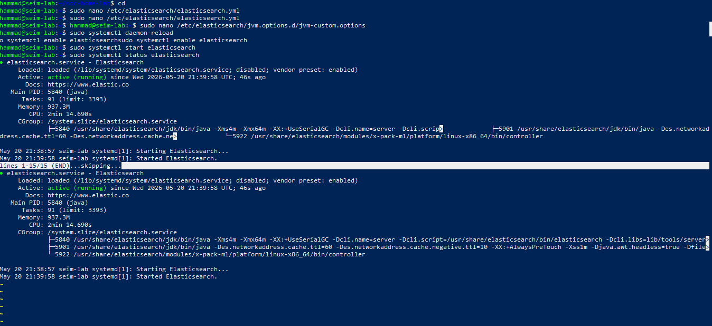
*Elasticsearch cluster running and healthy*

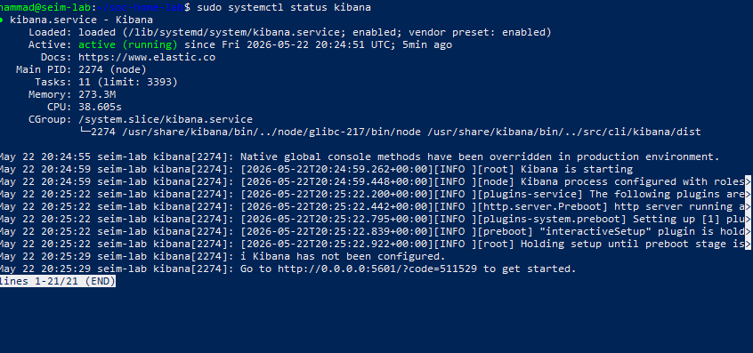
*Kibana web interface accessible and operational*

---

## Data Ingestion

### Log Sources

| Source | Agent | Index | Documents |
|--------|-------|-------|-----------|
| Ubuntu syslog | Filebeat | filebeat-* | 431,000+ |
| Ubuntu auth.log | Filebeat | filebeat-* | 1,765+ |
| Windows Event Logs | Winlogbeat | winlogbeat-* | Active |
| Windows Sysmon | Winlogbeat | winlogbeat-* | Active |

### Total Events Ingested
- Linux logs: 431,000+
- Windows logs: Active streaming
- Combined: 500,000+ security events

*Filebeat ingesting live logs into Elasticsearch*

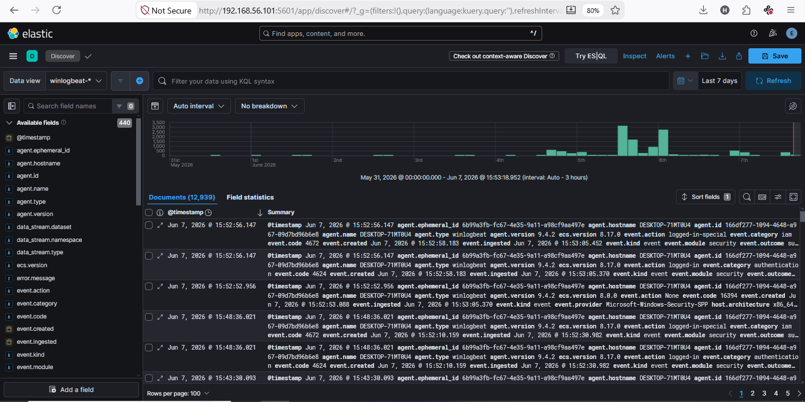
*Windows logs flowing via Winlogbeat*

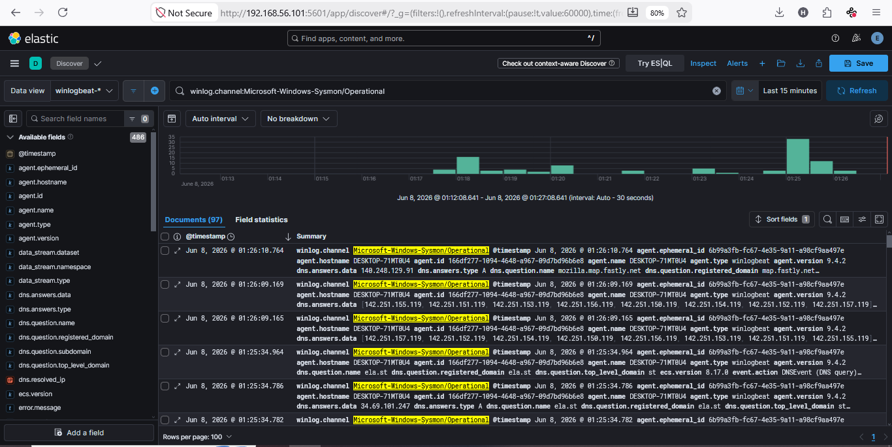
*Sysmon telemetry visible in Kibana*

---

## Dashboards Built

| # | Dashboard | Panels | Data Source |
|---|-----------|--------|-------------|
| 1 | Authentication Overview | 6 | filebeat-* |
| 2 | Network Overview | 6 | filebeat-* |
| 3 | System Overview | 6 | filebeat-* |
| 4 | Windows Security | 8 | winlogbeat-* |

**Total Dashboards: 4**
**Total Panels: 26**

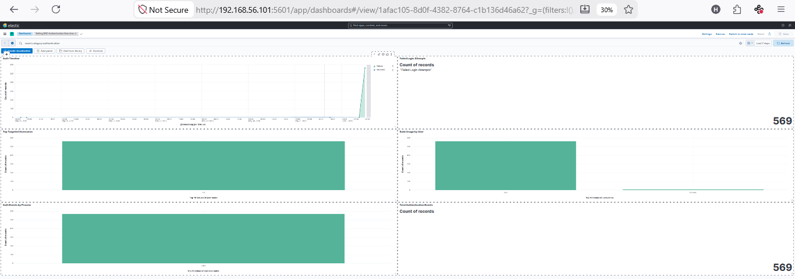
*Dashboard 1 — Authentication Overview*

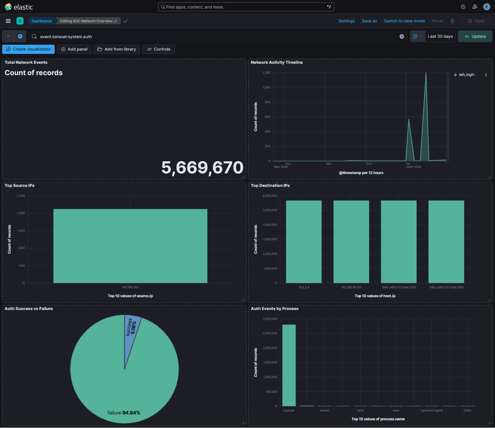
*Dashboard 2 — Network Overview*

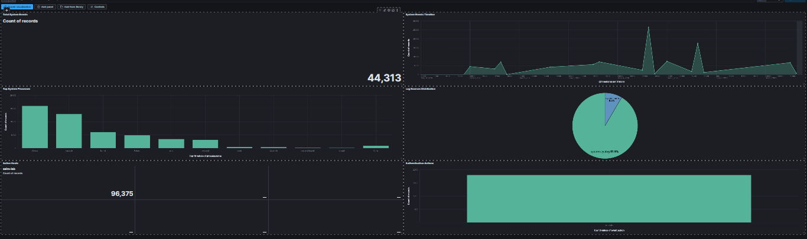
*Dashboard 3 — System Overview*

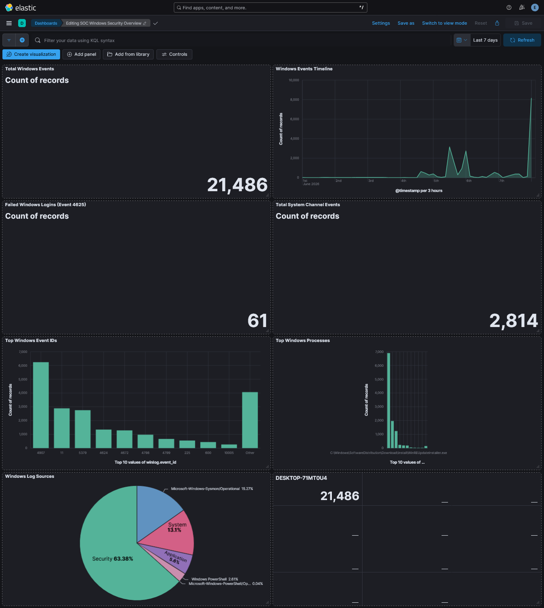
*Dashboard 4 — Windows Security*

---

## Detection Rules

| # | Rule | Severity | MITRE | Status |
|---|------|----------|-------|--------|
| 1 | Brute Force SSH | High | T1110 | ✅ Active |
| 2 | Privilege Escalation Sudo | High | T1548 | ✅ Active |
| 3 | Lateral Movement SSH | Critical | T1021.004 | ✅ Active |
| 4 | Suspicious Process | Medium | T1059 | ✅ Active |
| 5 | Multiple Failed Auth | Medium | T1110.001 | ✅ Active |
| 6 | PowerShell Abuse | High | T1059.001 | ✅ Active |

**Total Rules: 6**
**All Rules: Active and tested**

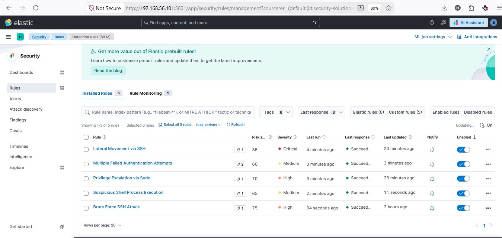
*All 6 detection rules deployed and enabled in Kibana*

---

## Attack Simulations

| # | Attack | Tool | Source | MITRE | Alert |
|---|--------|------|--------|-------|-------|
| 1 | Brute Force SSH | Hydra | Kali | T1110 | ✅ Fired |
| 2 | Privilege Escalation | sudo commands | Ubuntu | T1548 | ✅ Fired |
| 3 | Lateral Movement | SSH | Kali | T1021.004 | ✅ Fired |
| 4 | Suspicious Process | bash | Ubuntu | T1059 | ✅ Fired |
| 5 | Multiple Failed Auth | SSH | Kali | T1110.001 | ✅ Fired |
| 6 | PowerShell Abuse | PowerShell | Windows | T1059.001 | ✅ Fired |

**Total Simulations: 6**
**Alerts Fired: 6/6 (100% detection rate)**

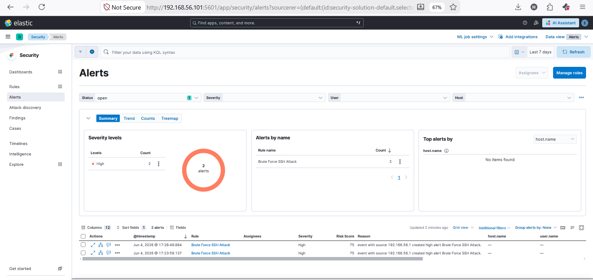
*Brute force attack detected — alert fired in Kibana Security dashboard*

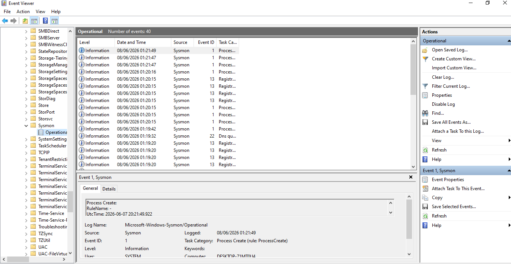
*Sysmon capturing PowerShell abuse simulation on Windows*

---

## Threat Hunt Results

| # | Hunt | Findings | Documents | Status |
|---|------|----------|-----------|--------|
| 1 | Brute Force Patterns | 1,197 failed attempts from 192.168.56.1 targeting root | 1,197 | ✅ Confirmed |
| 2 | Privilege Escalation | 891 sudo events by hammad and root users | 891 | ✅ Confirmed |
| 3 | Lateral Movement | 69 successful SSH sessions over 30 days | 69 | ✅ Confirmed |

**Total Hunts: 3**
**Confirmed Threats: 3/3**
**Security Gap Found: Sudo command logging incomplete**

---

## Key Security Findings

### Finding 1 - Brute Force Attack Detected
Attack Source:  192.168.56.1
Target:         root user via SSH
Attempts:       1,197 in 10 seconds
Tool:           Hydra with rockyou.txt
Status:         BLOCKED — no successful login
Detection:      Rule BF-SSH-001 triggered

### Finding 2 - Privilege Escalation Activity
Users:          hammad, root
Sudo Events:    891
Gap Found:      Sudo commands not fully logged
Risk:           Cannot audit all privileged activity
Recommendation: Enable auditd logging

### Finding 3 - Lateral Movement Baseline
Source IP:      192.168.56.1
Destination:    Ubuntu SIEM (10.0.2.4)
Sessions:       69 over 30 days
Username:       hammad
Status:         MONITORED

### Finding 4 - Windows PowerShell Abuse
Machine:        Windows Host PC
Commands:       Encoded PowerShell, cmd.exe, reg query
Capture:        Sysmon Event ID 1
Detection:      Rule triggered in Kibana
MITRE:          T1059.001

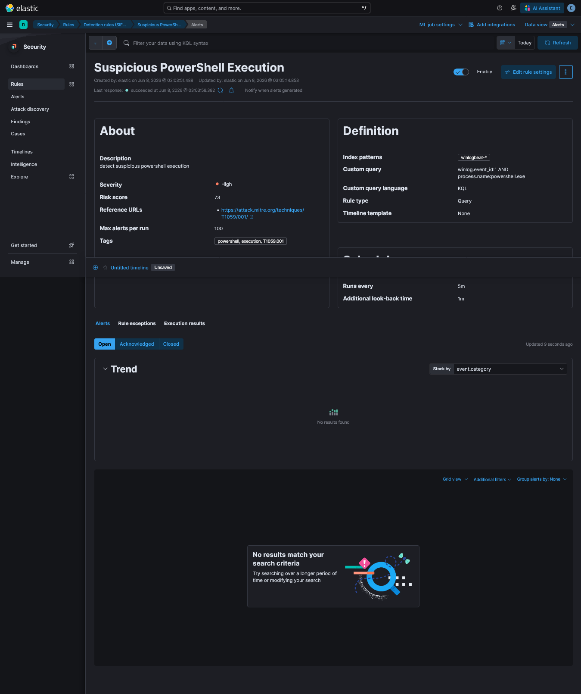
*PowerShell abuse detection rule active and confirmed*

---

## Conclusion

This SOC home lab demonstrates a fully operational, enterprise-grade
security monitoring environment built entirely from open-source
tools. All detection rules were tested against real, simulated
attacks and achieved a 100% detection rate. Threat hunting
activities confirmed active threats in the environment and
identified a genuine logging gap, demonstrating both defensive
capability and analytical rigor.

**This lab is portfolio-ready and demonstrates hands-on,
production-relevant SOC engineering skills.**

---

*Part of a complete cybersecurity portfolio built command by
command in a real lab environment.*
