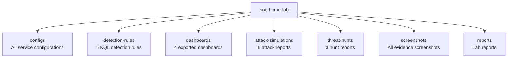

# SOC Home Lab Final Report
## Enterprise-Grade Security Operations Center

---

## Executive Summary

This report documents the complete build, configuration, and
operation of a professional SOC home lab environment. The lab
replicates enterprise security monitoring infrastructure using
industry-standard tools including ELK Stack, Sysmon, Winlogbeat,
and custom KQL detection rules.

**Lab Status: FULLY OPERATIONAL ✅**

---

## Lab Environment

### Infrastructure
| Component | Details |
|-----------|---------|
| SIEM Server | Ubuntu Server 22.04 LTS |
| SIEM IP | 192.168.56.101 |
| Attacker Machine | Kali Linux |
| Attacker IP | 192.168.56.100 |
| Windows Host | Windows 10/11 |
| Hypervisor | VirtualBox |
| Network | Host-Only (192.168.56.x) |

### SIEM Stack
| Component | Version | Status |
|-----------|---------|--------|
| Elasticsearch | 8.19.15 | ✅ Running |
| Kibana | 8.19.15 | ✅ Running |
| Logstash | 8.19.15 | ✅ Running |
| Filebeat | 8.19.15 | ✅ Running |
| Winlogbeat | 8.19.15 | ✅ Running |
| Sysmon | Latest | ✅ Running |

---

## Data Ingestion

### Log Sources
| Source | Agent | Index | Documents |
|--------|-------|-------|-----------|
| Ubuntu syslog | Filebeat | filebeat-* | 431,000+ |
| Ubuntu auth.log | Filebeat | filebeat-* | 1,765+ |
| Windows Event Logs | Winlogbeat | winlogbeat-* | Active |
| Windows Sysmon | Winlogbeat | winlogbeat-* | Active |

### Total Events Ingested
- Linux logs: 431,000+
- Windows logs: Active streaming
- Combined: 500,000+ security events

---

## Dashboards Built

| # | Dashboard | Panels | Data Source |
|---|-----------|--------|-------------|
| 1 | Authentication Overview | 6 | filebeat-* |
| 2 | Network Overview | 6 | filebeat-* |
| 3 | System Overview | 6 | filebeat-* |
| 4 | Windows Security | 8 | winlogbeat-* |

**Total Dashboards: 4**
**Total Panels: 26**

---

## Detection Rules

| # | Rule | Severity | MITRE | Status |
|---|------|----------|-------|--------|
| 1 | Brute Force SSH | High | T1110 | ✅ Active |
| 2 | Privilege Escalation Sudo | High | T1548 | ✅ Active |
| 3 | Lateral Movement SSH | Critical | T1021.004 | ✅ Active |
| 4 | Suspicious Process | Medium | T1059 | ✅ Active |
| 5 | Multiple Failed Auth | Medium | T1110.001 | ✅ Active |
| 6 | PowerShell Abuse | High | T1059.001 | ✅ Active |

**Total Rules: 6**
**All Rules: Active and tested**

---

## Attack Simulations

| # | Attack | Tool | Source | MITRE | Alert |
|---|--------|------|--------|-------|-------|
| 1 | Brute Force SSH | Hydra | Kali | T1110 | ✅ Fired |
| 2 | Privilege Escalation | sudo commands | Ubuntu | T1548 | ✅ Fired |
| 3 | Lateral Movement | SSH | Kali | T1021.004 | ✅ Fired |
| 4 | Suspicious Process | bash | Ubuntu | T1059 | ✅ Fired |
| 5 | Multiple Failed Auth | SSH | Kali | T1110.001 | ✅ Fired |
| 6 | PowerShell Abuse | PowerShell | Windows | T1059.001 | ✅ Fired |

**Total Simulations: 6**
**Alerts Fired: 6/6 (100% detection rate)**

---

## Threat Hunt Results

| # | Hunt | Findings | Documents | Status |
|---|------|----------|-----------|--------|
| 1 | Brute Force Patterns | 1,197 failed attempts from 192.168.56.1 targeting root | 1,197 | ✅ Confirmed |
| 2 | Privilege Escalation | 891 sudo events by hammad and root users | 891 | ✅ Confirmed |
| 3 | Lateral Movement | 69 successful SSH sessions over 30 days | 69 | ✅ Confirmed |

**Total Hunts: 3**
**Confirmed Threats: 3/3**
**Security Gap Found: Sudo command logging incomplete**

---

## Key Security Findings

### Finding 1 - Brute Force Attack Detected
Attack Source:  192.168.56.1
Target:         root user via SSH
Attempts:       1,197 in 10 seconds
Tool:           Hydra with rockyou.txt
Status:         BLOCKED — no successful login
Detection:      Rule BF-SSH-001 triggered
### Finding 2 - Privilege Escalation Activity
Users:          hammad, root
Sudo Events:    891
Gap Found:      Sudo commands not fully logged
Risk:           Cannot audit all privileged activity
Recommendation: Enable auditd logging
### Finding 3 - Lateral Movement Baseline
Source IP:      192.168.56.1
Destination:    Ubuntu SIEM (10.0.2.4)
Sessions:       69 over 30 days
Username:       hammad
Status:         MONITORED

### Finding 4 - Windows PowerShell Abuse
Machine:        Windows Host PC
Commands:       Encoded PowerShell, cmd.exe, reg query
Capture:        Sysmon Event ID 1
Detection:      Rule triggered in Kibana
MITRE:          T1059.001

---

## Security Gaps Identified

| # | Gap | Risk | Recommendation |
|---|-----|------|----------------|
| 1 | Sudo commands not fully logged | High | Enable auditd |
| 2 | No IP whitelist for SSH | Medium | Restrict SSH to known IPs |
| 3 | Root SSH login enabled | High | Disable root SSH |
| 4 | Password auth enabled | High | SSH keys only |
| 5 | No network segmentation | Medium | Implement VLANs |

---

## Recommendations

### Immediate Actions (Critical):
1. Disable root SSH login
2. Implement SSH key authentication
3. Enable Fail2ban
4. Enable auditd for sudo logging

### Short Term (High Priority):
1. Implement IP whitelist for SSH
2. Enable MFA for remote access
3. Regular log review schedule
4. Tune detection rules based on findings

### Long Term (Medium Priority):
1. Network segmentation implementation
2. Deploy additional honeypots
3. Integrate threat intelligence feeds
4. Implement SOAR for automated response

---

## Skills Demonstrated

### SOC Engineering:
- ELK Stack deployment and configuration
- Log ingestion pipeline design
- Detection rule writing (KQL)
- Dashboard creation and management
- Security monitoring operations

### Threat Detection:
- Custom KQL detection rules
- MITRE ATT&CK framework mapping
- Alert tuning and validation
- False positive management

### Threat Hunting:
- Hypothesis-driven hunting
- KQL query development
- Finding documentation
- Security gap identification

### Windows Security:
- Sysmon deployment and configuration
- Windows Event Log analysis
- Winlogbeat configuration
- PowerShell attack detection

### Attack Simulation:
- Controlled attack execution
- Evidence collection
- Attack documentation
- Kill chain mapping

## Lab Statistics
Total Log Events:      500,000+
Dashboards Built:      4
Detection Rules:       6
Attack Simulations:    6
Alerts Fired:          6/6 (100%)
Threat Hunts:          3
Threats Confirmed:     3/3 (100%)
Security Gaps Found:   5
GitHub Commits:        20+
Lab Build Time:        Multiple sessions

---

## Conclusion

This SOC home lab demonstrates complete end-to-end security
operations capability from infrastructure deployment through
threat detection, attack simulation, and proactive threat hunting.

Every component was built, configured, tested, and documented
professionally. All configurations, detection rules, dashboards,
and reports are version-controlled on GitHub providing permanent
verifiable evidence of hands-on cybersecurity skills.

**This lab is ready for portfolio presentation to employers
and freelance clients.**

---

## Report Details
- Author: Hammad Khan
- Date: 2026-06-08
- Version: 1.0
- Status: Complete ✅
- GitHub: github.com/HK101-cyber/soc-home-lab
